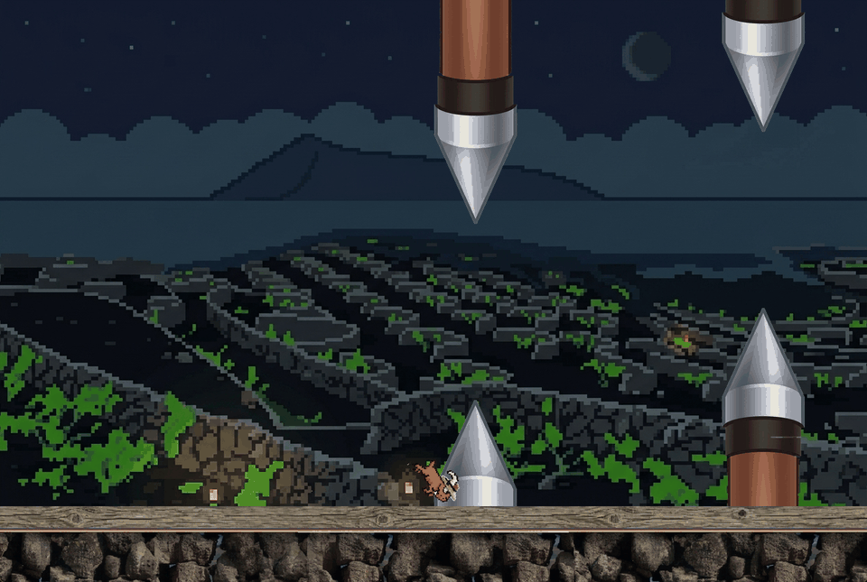
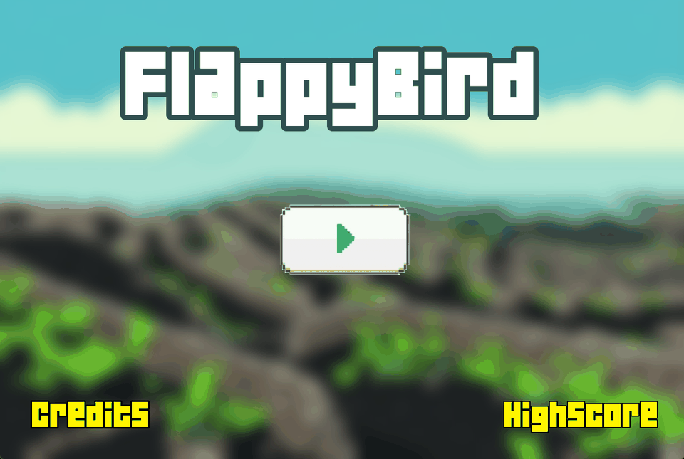
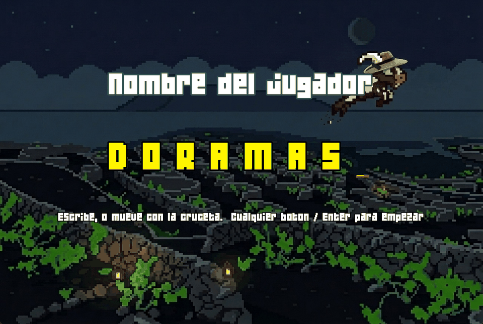
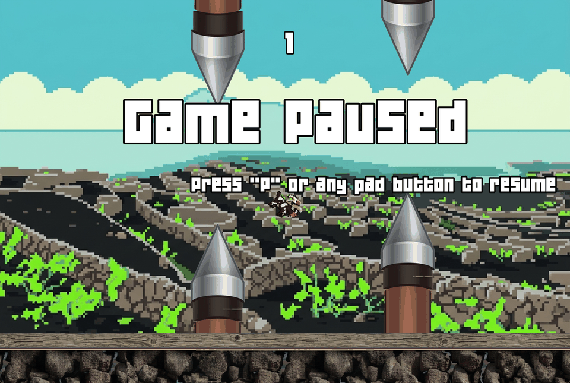
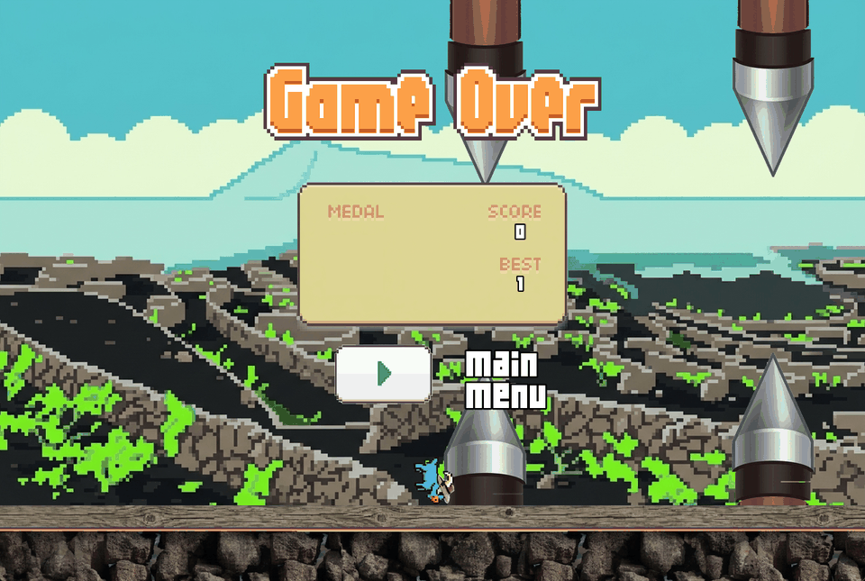
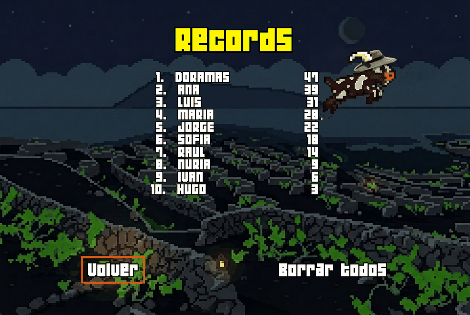
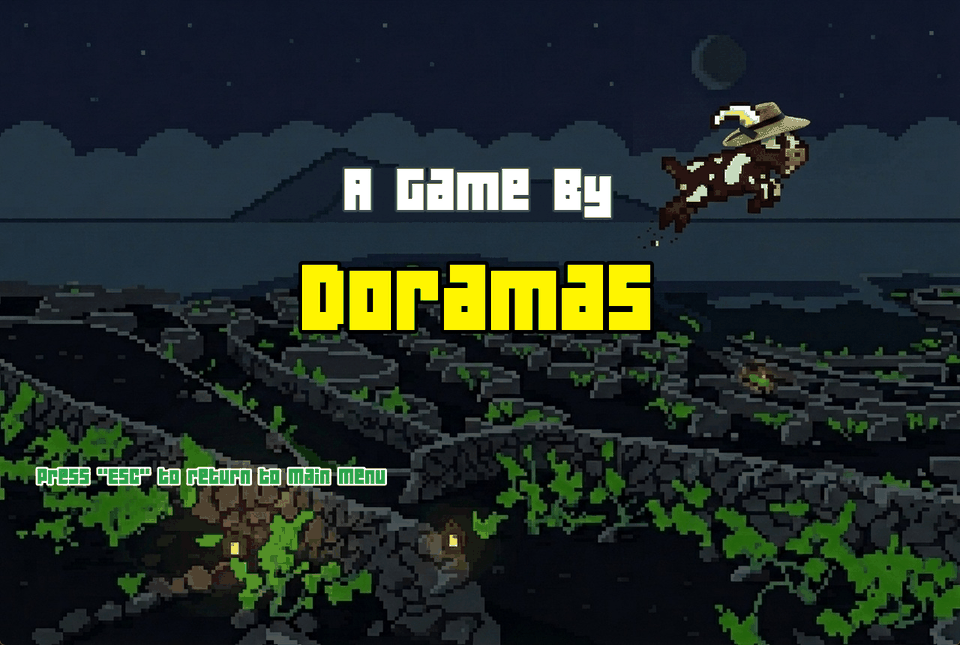
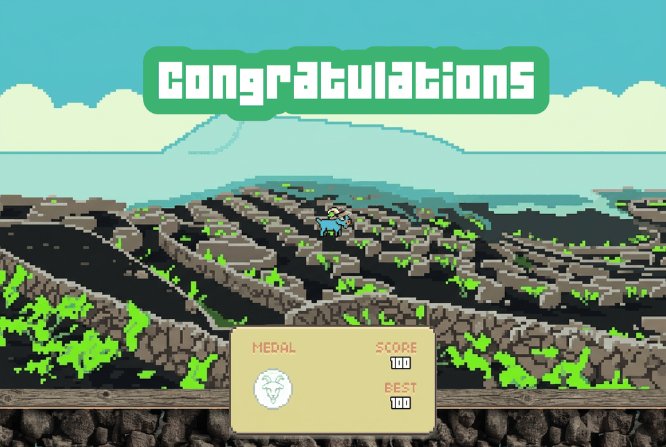

# BaifoBird

Juego tipo Flappy Bird escrito en C++ con SFML, que corre en **Windows, Linux
(incluida Raspberry Pi) y Android** desde una única base de código.

Una cabra con sombrero de paja esquiva lanzas sobre un paisaje volcánico. Las
puntuaciones se guardan en SQLite con el nombre del jugador, y se juega con
teclado, ratón, mando o pantalla táctil.



---

## Cómo se juega

La cabra cae sola y sube cada vez que pulsas. Hay que pasar entre las lanzas;
tocar una lanza, el suelo o salir por arriba termina la partida. Cada par
superado suma un punto, y **se gana al pasar 100**.

Antes de cada partida se pide un **nombre de jugador**, y al terminar la partida
se guarda con ese nombre.

### Controles

| Acción | Teclado | Ratón | Mando | Táctil |
|---|---|---|---|---|
| Aletear / confirmar | Espacio, Enter | clic | **cualquier botón** | toque |
| Mover el foco del menú | flechas | — | cruceta o stick | — |
| Pulsar un elemento | — | clic encima | confirmar | toque encima |
| Escribir el nombre | teclear, Retroceso | — | ↑↓ letra, ←→ casilla | — |
| Pausar | ESC | — | cruceta/stick abajo | — |
| Reanudar | P | — | cualquier botón | — |
| Volver (créditos, récords) | ESC | — | cualquier botón | toque |

Los medallas dependen de la puntuación: bronce a partir de 10, plata 20, oro 30
y platino 40.

---

## Ejecutar en Windows

Requisitos: **Visual Studio** (bastan las Build Tools) con las herramientas de
C++ x64, y **SFML 2.6.2** descomprimido en `SFML-2.6.2/` en la raíz del
proyecto ([descarga](https://www.sfml-dev.org/download/sfml/2.6.2/), versión
para Visual C++ de 64 bits).

```bat
cd FlappyBird\FlappyBird-Win
build.bat
FlappyBird.exe
```

El script deja el ejecutable en esa misma carpeta, junto a `assets\`, `audios\`
y `fonts\`, y **hay que lanzarlo desde ahi**: esas rutas son relativas al
directorio de trabajo, no al del binario.

Opciones:

```bat
FlappyBird.exe                 :: ventana de 1280x860
FlappyBird.exe 800x480         :: cualquier tamaño
FlappyBird.exe --fullscreen    :: pantalla completa (ESC en el menú sale)
FlappyBird.exe --help
FlappyBird.exe --debug         :: FPS, dt y cajas de colision en pantalla
```

## Ejecutar en Linux y Raspberry Pi

```bash
sudo apt install build-essential libsfml-dev
cd FlappyBird/FlappyBird-Linux
./build.sh
./FlappyBird
```

Acepta las mismas opciones que en Windows. La primera compilación tarda porque
compila SQLite; luego se reutiliza el `.o`.

**En Raspberry Pi hay que compilar en el propio Pi**: un binario x86_64 no se
ejecuta en ARM. Copia el proyecto y lanza `./build.sh` allí, desde `FlappyBird/FlappyBird-Linux/`. Para arranque en
modo kiosco, `--fullscreen`.

> **Tras cada `git pull` hay que volver a lanzar `./build.sh`.** El ejecutable
> no está en el repositorio —`.gitignore` excluye
> `FlappyBird/FlappyBird-Linux/FlappyBird`— así que actualizar el código deja el
> binario viejo tal cual estaba y el juego sigue comportándose igual que antes.
> Es rápido: `sqlite3.o` queda cacheado y solo se recompilan `main.cpp` y
> `scoredb.cpp`. Si tienes el modo kiosco puesto, después `sudo reboot`.

> **No lo lances nunca con `sudo`.** `scores.db` se crea con el dueño del
> proceso, así que una sola partida como root deja el fichero en `root:root` y a
> partir de ahí el juego ya no puede escribirlo: sigue siendo jugable, pero no
> guarda nada y solo avisa por `stderr` —invisible en modo kiosco—. Si te ha
> pasado:
>
> ```bash
> ls -l scores.db                  # ¿pone root root?
> sudo chown $USER:$USER scores.db
> ```

### Rendimiento en Raspberry Pi

El juego **detecta la Raspberry Pi** (por `/proc/device-tree/model`) y arranca a
**800x538** en vez de 1280x860, un 39 % de los píxeles. En un PC no cambia nada.

El coste dominante es el *relleno*: los píxeles de la ventana, no el tamaño de
las texturas. Por eso bajar resolución es lo que más se nota. Puedes forzar otra:

```bash
./FlappyBird 640x430     # aún menos, si la Pi 3 sigue justa
./FlappyBird 1280x860    # forzar el tamaño completo
```

`--fullscreen` **ya no hereda la resolución del escritorio en una Pi**. Antes sí,
y era una trampa: en el monitor de pruebas el escritorio estaba a 1280x720 y el
juego pasaba de 430.400 px a 921.600 sin avisar. Ahora busca el modo de vídeo
anunciado más grande que no pase del presupuesto de 800x538 y usa ese; en ese
monitor sale 720x480, que además tiene casi la misma proporción que el lienzo
(1.50 frente a 1.49). Lo dice al arrancar:

```
Raspberry Pi detectada: pantalla completa a 720x480 en vez de 1280x720
```

Si quieres otro, ahora `--fullscreen` respeta el tamaño explícito siempre que el
driver anuncie ese modo (`xrandr` los lista):

```bash
./FlappyBird 800x600 --fullscreen
```

Y el **tope de fotogramas en Pi es 60**, no 144. En un monitor que anuncie
1280x720 a 120 Hz —el caso real que motivó el cambio— el vsync pedía 120
fotogramas por segundo. Renderizar por encima de 60 en una Pi es trabajo tirado:
el juego está diseñado para 60 y el resto solo calienta la placa.

Para medir en vez de suponer, `--debug` muestra FPS reales, el `dt` máximo y las
cajas de colisión:

```bash
./FlappyBird 800x480 --debug
```

Si **`dt max` se queda pegado a 50 ms**, la máquina no llega a 20 FPS: el paso de
tiempo toca su tope y el juego pasa a cámara lenta, con saltos grandes entre
fotogramas que hacen que las colisiones *parezcan* injustas aunque sean
correctas. Es la señal de que hay que bajar resolución.

### Antes de culpar al juego: alimentación

Ninguna optimización de código compensa una Pi mal alimentada. **Comprueba esto
primero**, porque contamina cualquier otra medida:

```bash
vcgencmd get_throttled     # lo quieres a 0x0
vcgencmd measure_temp
vcgencmd measure_clock arm # un 3 B+ sano da 1.400.000.000 bajo carga
```

`get_throttled` es un mapa de bits:

| bit | valor | significado |
|---|---|---|
| 0 | `0x1` | bajo voltaje **ahora mismo** |
| 1 | `0x2` | frecuencia de ARM recortada ahora |
| 2 | `0x4` | limitada **ahora mismo** |
| 16 | `0x10000` | ha habido bajo voltaje desde el arranque |
| 18 | `0x40000` | ha habido limitación desde el arranque |

En la Pi 3 B+ de pruebas salía **`0x50005`** (bits 0, 2, 16 y 18) a solo 54,8 °C
—o sea, no era calor— con la CPU clavada en **600 MHz**, el 43 % de su
frecuencia. La pista definitiva es la contradicción entre estas dos lecturas:

```bash
cat /sys/devices/system/cpu/cpu0/cpufreq/scaling_cur_freq   # 1400000
vcgencmd measure_clock arm                                  # 600000000
```

El kernel cree que va a 1,4 GHz y el firmware mide 600 MHz. Eso es el recorte
por bajo voltaje: el firmware ignora al kernel. Un Pi 3 B+ pide **5,1 V y 2,5 A
reales**, y la causa más frecuente no es el cargador sino **el cable**: fino,
largo, o de los que solo sirven para cargar.

Que la aceleración por hardware esté activa se comprueba aparte:

```bash
ls /dev/dri                                       # card0 y renderD128
grep -n vc4 /boot/firmware/config.txt             # dtoverlay=vc4-kms-v3d
sudo apt install -y mesa-utils && glxinfo -B | grep -i renderer
```

Si `glxinfo` dice **`llvmpipe`**, estás renderizando por CPU y no hay nada que
optimizar en el juego hasta arreglar eso.

### Preparar la Pi al máximo (`optimize-pi.sh`)

En `FlappyBird/FlappyBird-Linux/` hay un script que deja la Pi lo más despejada
posible, y opcionalmente hace que **el juego sea lo único que arranca**:

```bash
cd FlappyBird/FlappyBird-Linux
./optimize-pi.sh --dry-run          # enseña qué haría, sin tocar nada
sudo ./optimize-pi.sh --apply       # optimiza el sistema
sudo ./optimize-pi.sh --apply --kiosk   # además, arranca solo el juego
sudo ./optimize-pi.sh --apply --kiosk --mode=1024x768   # otra resolución de kiosco
sudo ./optimize-pi.sh --apply --kiosk --rate=50         # otros Hz de kiosco
sudo ./optimize-pi.sh --revert      # deshace todo
```

Qué hace:

| Cambio | Por qué |
|---|---|
| `gpu_mem=128` | por defecto la VideoCore IV solo tiene 76 MB, justos para las texturas |
| Gobernador `performance`, vía unidad de systemd | `ondemand` baja la CPU a 600 MHz y sube tarde: tirones al arrancar el movimiento |
| Desactiva avahi, triggerhappy, ModemManager, cups | no pintan nada mientras se juega |
| Sin salvapantallas ni apagado de pantalla | `xset s off -dpms` |
| `--kiosk`: arranque a consola + autologin + X con el juego como único cliente | se ahorra el escritorio entero (compositor, panel, gestor de archivos) |
| `--kiosk` pone X a **800x600 @ 60 Hz** antes de ir a pantalla completa | 480.000 px, cerca del presupuesto de 800x538 |

Dos detalles que costaron una tarde de diagnóstico:

- El gobernador se fija con una **unidad de systemd**, no escribiendo
  `/etc/default/cpufrequtils`. Ese fichero solo lo lee el paquete
  `cpufrequtils`, que Raspberry Pi OS **no trae instalado**: durante un tiempo el
  script decía haber fijado `performance` y la Pi seguía en `ondemand` después
  de cada reinicio.
- El `xrandr` del kiosco pasa **`--rate`**. Sin él, `xrandr --mode 1280x720`
  cogía el primer modo de la lista, que en el monitor de pruebas era de
  **120 Hz**: el vsync pedía 120 fotogramas de 921.600 px a una Pi 3, unas
  4,3 veces el relleno que se pretendía.

**Qué NO toca, a propósito:**

- **SSH y la red.** Apagarlos en una Pi headless es quedarse sin acceso a la
  máquina, y no compensa por unos FPS.
- **El Bluetooth**, salvo que se pida con `--no-bluetooth`: los mandos
  inalámbricos lo necesitan.
- **La swap** (riesgo de quedarse sin memoria) y **el overclock** (depende de la
  placa y su refrigeración).

Antes de modificar nada copia los ficheros a `/var/backups/baifobird-<fecha>/`,
y `--revert` los restaura. Se niega a ejecutarse si no detecta una Raspberry Pi.

En modo kiosco: **ESC** en el menú principal cierra el juego, y **Ctrl+Alt+F2**
te lleva a una consola.

### Qué se optimizó y por qué

En la Pi el coste que manda es el **relleno** (píxeles escritos), no el número
de llamadas de dibujo: durante la partida son solo ~10.

| Cambio | Efecto |
|---|---|
| Solo se mueven y dibujan las lanzas visibles | de ~200 llamadas de dibujo a 4–6 |
| Textura de la lanza asignada al desovar | 200 `setTexture` por fotograma menos |
| Fondos y suelo con `BlendNone` | son 100 % opacos: la GPU se ahorra leer el destino y mezclar |
| Mipmaps en los fondos | siempre salen escalados; leer de un nivel reducido gasta menos ancho de banda y quita el parpadeo |
| El marcador solo se regenera al cambiar | `setString` reconstruye la geometría del texto |
| Resolución por defecto de 800x538 en Pi | 39 % de los píxeles |
| `--fullscreen` elige el modo más pequeño que quepa en el presupuesto | heredar el del escritorio duplicaba los píxeles sin avisar |
| Tope de 60 fps en Pi en vez de 144 | un monitor que anuncie 120 Hz pedía el doble de fotogramas |
| Kiosco a 800x600 **@ 60 Hz** | sin `--rate`, `xrandr` cogía el primer modo, que era de 120 Hz |
| Sin servidor gráfico (SFML-Pi) | se ahorra Xorg entero: CPU, memoria y una copia por fotograma |

Las cuatro últimas salieron de medir una Pi 3 B+ real. La combinación que había
—kiosco a 1280x720 a 120 Hz— pedía **110,6 Mpx/s**; con 800x600 a 60 fps son
**28,8 Mpx/s**, y sin X por medio.

**No** se quitó `window.clear()`, aunque el fondo ya cubre toda la pantalla: la
VideoCore IV es un renderizador **por tiles**, y ahí el `clear` le dice al driver
que no cargue el contenido anterior del framebuffer. Quitarlo sería
contraproducente.

Los mipmaps se aplican **solo a los fondos**: la cabra, las lanzas y el suelo se
dejan sin suavizar para que el pixel art siga nítido.

### Sin servidor gráfico: SFML-Pi

Si aún hace falta más, queda la mayor ganancia estructural: quitar X11 de la
ecuación. [**SFML-Pi**](https://github.com/mickelson/sfml-pi) es un fork de SFML
que dibuja directamente por **DRM/KMS**, sin servidor gráfico.

```bash
cd FlappyBird/FlappyBird-Linux
./install-sfml-pi.sh          # compila e instala en /opt/sfml-pi (tarda)
./build.sh                    # lo detecta y enlaza contra él, con rpath
```

**Comprueba que de verdad lo está usando.** `build.sh` termina diciendo
`verificado: enlazado contra SFML-Pi (sin X11)`, y si no, avisa. La prueba
independiente es:

```bash
readelf -d ./FlappyBird | grep PATH   # RUNPATH -> /opt/sfml-pi/lib
ldd ./FlappyBird | grep sfml          # más legible, mismo veredicto
```

Los scripts usan **`readelf`, no `ldd`**: `ldd` resuelve las dependencias
*ejecutando* el binario, y sobre uno recién enlazado dio algún falso negativo
suelto que no se llegó a explicar. `readelf` solo lee la cabecera ELF, así que
no depende de que el binario pueda ejecutarse ni del entorno.

Esto importa porque de esa comprobación depende todo lo demás: `optimize-pi.sh
--kiosk` decide si monta el kiosco sin X mirando precisamente ese `RUNPATH`. Si
el binario quedó enlazado contra el SFML del sistema, el kiosco arrancará X sin
decir nada.

Después hay que ejecutarlo **desde una consola, sin escritorio** (Ctrl+Alt+F2).
Con DRM **no existen las ventanas**: solo hay los modos de vídeo que el conector
anuncia, y la resolución la fija el modo, no un `ANCHOxALTO` cualquiera.

```bash
SFML_DRM_MODE=800x600 ./FlappyBird
SFML_DRM_DEBUG=1 ./FlappyBird     # imprime el modo elegido
```

Por eso `build.sh` define **`-DBAIFOBIRD_DRM`** cuando enlaza contra SFML-Pi, y
con ese macro el juego fuerza pantalla completa y deja de pedir su tamaño
cómodo de ventana. Sin eso pedía 800x538 —que no es un modo de vídeo real— y
moría al arrancar con un mensaje que no orienta nada:

```
Failed to set mode: No space left on device
```

Ese `ENOSPC` es lo que devuelve `drmModeSetCrtc` cuando el modo pedido no
existe. **No tiene nada que ver con el disco**, aunque lo parezca: si te sale,
`df -h` estará perfectamente y el problema es la resolución.

Un detalle práctico para diagnosticar: en modo kiosco sin X, la salida de error
del juego se pierde en la consola. Para verla, redirige a un fichero en el
bloque de arranque de `~/.bash_profile`:

```bash
SFML_DRM_MODE=800x600 exec ./FlappyBird > /tmp/baifobird.log 2>&1
```

`optimize-pi.sh --kiosk` lo detecta: si SFML-Pi está instalado, monta el kiosco
**sin arrancar X**; si no, cae a la sesión X mínima de siempre.

Decisiones que conviene conocer:

- Se instala en **`/opt/sfml-pi`**, no en `/usr/local`. Un `make install` normal
  pisaría el SFML del sistema y dejaría dos versiones peleándose; así se borra
  con un `rm -rf` y no afecta a nada más. El binario lleva `rpath`, así que no
  hace falta `LD_LIBRARY_PATH`.
- Se usa **DRM/KMS y no DISPMANX**: DISPMANX solo existe para Pi 0–3 pero
  necesita `/opt/vc`, que Raspberry Pi OS Bookworm ya no incluye.
- Sin X11 la entrada se lee por udev desde `/dev/input/event*`, así que el
  usuario debe estar en el grupo **`input`**. El script lo añade.
- `build.sh` añade **`-lgbm`** al enlazar. Su `libsfml-window.so` usa símbolos
  de GBM pero no declara `libgbm` entre sus dependencias
  (`objdump -p libsfml-window.so | grep NEEDED` lista `libdrm`, `libEGL`,
  `libudev` y `libGL`, pero no `libgbm`), así que el ejecutable tiene que
  aportarla o el enlazado muere con veinte `referencia a gbm_* sin definir`.
  Es un descuido del empaquetado del fork, no algo que se pueda arreglar aquí.

**Su autor lo describe como experimental**, válido solo si te basta una ventana
a pantalla completa — que es nuestro caso. Si algo va mal:
`./install-sfml-pi.sh --uninstall && ./build.sh` vuelve al SFML normal.

Si quieres jugar con mando, hace falta el módulo `joydev` y estar en el grupo
`input` (ambos vienen de serie en Raspberry Pi OS). Comprobación rápida:
`ls /dev/input/js*` debe listar algo con el mando encendido.

### Errores que no significan lo que parece

Todos estos son reales, salieron poniendo esto en marcha en una Pi 3 B+, y en
todos el mensaje apunta al sitio equivocado.

| Mensaje | Qué es en realidad |
|---|---|
| `Failed to set mode: No space left on device` | **No es el disco.** Es `ENOSPC` de `drmModeSetCrtc`: pediste una resolución que no es un modo de vídeo real. Comprueba `SFML_DRM_MODE` contra los modos que anuncia el monitor |
| `Failed to set mode: Permission denied` | Estás lanzándolo por SSH. Con DRM hace falta ser *DRM master*, y eso solo pasa en la consola física (`Ctrl+Alt+F2`) |
| `Failed to open X11 display` | Binario enlazado contra el SFML **del sistema**, ejecutándose sin X. O te falta `DISPLAY=:0`, o querías SFML-Pi y `ldd` te dirá que no lo tienes |
| `attempt to write a readonly database` | `scores.db` es de otro usuario, casi siempre `root` por haber lanzado el juego una vez con `sudo`. `sudo chown $USER:$USER scores.db` |
| El juego arranca y se cierra en bucle | Míralo en un log: en kiosco sin X, `stderr` se pierde en la consola. Ver arriba cómo redirigirlo |
| `optimize-pi.sh` dice `performance` pero sigue en `ondemand` | Versiones viejas escribían `/etc/default/cpufrequtils`, que **nadie lee** si el paquete no está instalado. Ahora se usa una unidad de systemd; compruébalo con `systemctl is-enabled baifobird-governor` |
| Va lento aunque todo esté bien configurado | Mira la alimentación antes que nada: `vcgencmd get_throttled`. Ver la sección de arriba |

## Ejecutar en Android

Hay un APK de depuración listo: **`FlappyBird/BaifoBird-debug.apk`**
(arm64-v8a, Android 5.0 o superior).

```bash
adb install -r FlappyBird/BaifoBird-debug.apk
```

Para recompilarlo hacen falta SDK 34, NDK 25.2.9519653, CMake 3.31, Gradle 8.7
y **JDK 17** (Gradle 8.7 y AGP 8.1 no admiten JDK más nuevos), además de SFML
compilado para Android e instalado en el NDK:

```bash
cd SFML-2.6.2 && mkdir bld-arm64 && cd bld-arm64
cmake -G Ninja \
      -DCMAKE_TOOLCHAIN_FILE=<ndk>/build/cmake/android.toolchain.cmake \
      -DANDROID_ABI=arm64-v8a -DANDROID_PLATFORM=android-21 \
      -DANDROID_STL=c++_shared -DCMAKE_BUILD_TYPE=Release ..
cmake --build . && cmake --install .

cd FlappyBird/FlappyBird-Android && gradle assembleDebug
```

---

## Cómo funciona

### Una sola fuente para las tres plataformas

`FlappyBird/src/main.cpp` es la **única** fuente del juego. La compilan
`build.bat`, `build.sh` y el `Android.mk` de Gradle. No hay copias por
plataforma, así que un cambio llega a las tres a la vez. Lo específico de
Android son unas pocas líneas bajo `#ifdef SFML_SYSTEM_ANDROID`.

Como consecuencia, el código tiene que compilar contra **tres SFML distintos**:
2.6.2 en Windows y Android, el 2.5.1 parcheado de Debian en Raspberry Pi OS, y
el 2.5.1 de origen en SFML-Pi. Eso obliga a una convención que parece
retrógrada y no lo es:

> **Usa `Keyboard::Return` y `Keyboard::BackSpace`, no `Enter` ni `Backspace`.**
> SFML 2.6 renombró esas dos teclas dejando los nombres viejos como alias.
> Debian retroportó el cambio a su paquete 2.5.1, así que en Raspberry Pi OS
> compilan los dos nombres y la incompatibilidad no se nota — hasta que
> enlazas contra SFML-Pi, que es un fork del 2.5.1 **sin** ese parche, y el
> juego deja de compilar. Los nombres viejos existen en las tres versiones.

### Movimiento por tiempo, no por fotograma

El juego original movía todo "por fotograma" con vsync, así que su velocidad
dependía de los Hz del monitor: a 144 Hz iba **2.4 veces más rápido** que a 60.
Ahora todo está en unidades por segundo e integrado con `dt`. Comprobado a
30, 60 y 144 FPS: misma trayectoria y mismo punto de aterrizaje.

El paso de tiempo está acotado (`MaxFrameTime`); sin ese tope, tras un alt-tab
el juego integraría cientos de píxeles de golpe y la cabra atravesaría una lanza
sin que la colisión llegara a detectarla.

### El salto

Es un **impulso por pulsación**: mantener pulsado no sube más. Usa gravedad
asimétrica —floja al subir, fuerte al caer— porque con un impulso la altura del
arco es `v₀²/2g` y el tiempo en el aire `2v₀/g`, o sea que **ambos bajan si sube
la gravedad**. Así se consigue un salto amplio y lento con una caída que pesa:
122 px de arco y 0.72 s en el aire.

### Un lienzo fijo escalado a cualquier pantalla

Todo se dibuja en coordenadas de **1280×860** y una `sf::View` lo lleva a la
pantalla real. En proporciones distintas no se deforma ni se recorta: se ve
**más mundo a los lados**. Por eso el mismo código sirve para una ventana de
escritorio, una pantalla pequeña de Pi y un móvil 21:9.

Los tests de posición usan `mapPixelToCoords()`, que aplica esa misma View, así
que ratón y dedo aciertan a cualquier escala sin código aparte.

### La colisión sigue la forma de la lanza

El arma no es un rectángulo: se afila desde el 88 % de su largo hasta acabar en
pico. Una caja recta cubría ahí **hasta 52 px de más por lado**, justo en la
zona del hueco, y se moría «contra el aire».

La colisión usa un perfil de 10 bandas medido sobre el propio asset, que baja
de 52 px de semiancho en el asta a 2 px en el pico, pasando por los 60 px del
reborde metálico. Cada banda toma el semiancho **menor** de sus dos extremos,
así que la caja nunca sobresale del dibujo: si hay error, es a favor del
jugador. Se puede ver con `--debug`.

### Puntuaciones en SQLite

En `scores.db`, junto al ejecutable (en Android, en el almacenamiento interno de
la app). Se usa la amalgamación oficial incrustada en `third_party/sqlite`, así
que **no hay que instalar nada** en ninguna plataforma.

```sql
CREATE TABLE scores (
  id        INTEGER PRIMARY KEY AUTOINCREMENT,
  name      TEXT    NOT NULL,
  score     INTEGER NOT NULL,
  played_at TEXT    NOT NULL DEFAULT (datetime('now'))
);
```

El nombre se inserta con sentencia preparada, nunca concatenado en el SQL. La
pantalla de récords muestra las 10 mejores y permite borrarlas todas, con un
paso de confirmación que dice cuántas se van a borrar.

### El mando funciona con cualquier modelo

SFML numera los botones del 0 al 31 **sin darles significado**, y el índice de
cada botón físico cambia entre modelos y entre plataformas: no existe una tabla
universal. En cambio sí da significado a los **ejes** (`X`/`Y` es el stick,
`PovX`/`PovY` la cruceta).

Por eso el diseño no usa ningún índice de botón: se **navega por ejes** y
**cualquier botón confirma**. Como el signo de los ejes tampoco está
documentado, la navegación es **circular**: aunque venga invertido, se alcanza
todo pulsando en la misma dirección.

### Los assets se generan con un script

`build_assets.py` construye los 23 assets del juego a partir de los sprites
originales de `FlappyBird/imgs/`: recorta fondos (blanco en las cabras, negro en las
lanzas), normaliza los fotogramas de animación a un lienzo común, hace el suelo
repetible y compone las medallas.

```bash
pip install pillow numpy scipy
python build_assets.py
```

Dos detalles que conviene no romper:

- La textura del suelo es de **2048×128, potencia de dos**. La GPU de la
  Raspberry Pi 3 tiene `GL_MAX_TEXTURE_SIZE = 2048`, y el suelo se dibuja con
  `setRepeated(true)`, que SFML no garantiza sobre texturas que no lo sean.
- Las lanzas se recortan rellenando el hueco de cada fila, no por umbral de
  color: el collar bajo la punta es casi negro como el fondo, y un umbral lo
  volvía transparente.

---

## Estructura

```
build_assets.py           genera los assets desde los sprites originales
third_party/sqlite/       amalgamación de SQLite

FlappyBird/
  src/                    FUENTE ÚNICA de las tres plataformas
  imgs/                   sprites originales (entrada de build_assets.py)
                          y capturas del juego
  FlappyBird-Win/         build.bat + assets + DLL; el .exe queda aquí
  FlappyBird-Linux/       build.sh  + assets;      el binario queda aquí
      build.sh            compila; detecta SFML-Pi y enlaza contra él
      install-sfml-pi.sh  instala SFML-Pi en /opt (juego sin servidor gráfico)
      optimize-pi.sh      prepara la Pi y monta el modo kiosco
  FlappyBird-Android/     proyecto Gradle; usa ../src vía Android.mk
  BaifoBird-debug.apk     APK listo para instalar
```

Cada script de compilación vive en la carpeta de su plataforma y deja ahí el
binario, junto a los datos que necesita. `build_assets.py` se queda en la raíz
porque no es de ninguna plataforma: alimenta a las tres.

`SFML-2.6.2/` no está en el repositorio: descárgalo aparte (ver arriba).

---

## Capturas

Menú principal
:-------------------------:


Nombre del jugador — se pide antes de cada partida
:-------------------------:


En partida
:-------------------------:


Pausa
:-------------------------:


Game Over
:-------------------------:


Récords — con el recuadro de foco y la opción de borrar
:-------------------------:


Créditos
:-------------------------:


Victoria — al pasar las 100 lanzas
:-------------------------:


---

## Autor

- Doramas

Basado en un clon de Flappy Bird en SFML; el arte, la física, el sistema de
puntuaciones, el soporte de mando y la versión de Android son propios.
